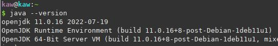
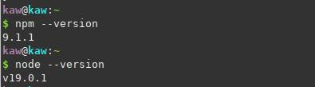

# Setup-for-local
This repo contains a readme for setup on local environment plus any other important docs for project planning.


# Setting up ElasticSearch on linux(debian + arch) & other platforms

## Install Java
 * *(Elastic Search uses Java jdk)* 
 **Elasticsearch requires at least Java version 7,**
 
 ##### Debian Based :
 * Check which version is available
    ``` 
        sudo apt search jdk
    ```
 * install stable version , for me it is 11 now.   
    ```
    sudo apt install openjdk-11-jdk

    ```
    

##### Windows
*   [Step by Step to install jdk](https://www.guru99.com/install-java.html)


## Install ElasticSearch
[Documentation](https://www.elastic.co/guide/en/elasticsearch/reference/8.5/targz.html)

##### Debian Based
```
        wget https://artifacts.elastic.co/downloads/elasticsearch/elasticsearch-8.5.0-linux-x86_64.tar.gz
        wget https://artifacts.elastic.co/downloads/elasticsearch/elasticsearch-8.5.0-linux-x86_64.tar.gz.sha512
        shasum -a 512 -c elasticsearch-8.5.0-linux-x86_64.tar.gz.sha512 
        tar -xzf elasticsearch-8.5.0-linux-x86_64.tar.gz
        cd elasticsearch-8.5.0/  
```

##### Others
[Installation link guide](https://www.elastic.co/guide/en/elasticsearch/reference/8.5/install-elasticsearch.html)

## Install Kibana
[Installation link guide](https://www.elastic.co/guide/en/kibana/current/install.html)
##### Debian Based
```
    curl -O https://artifacts.elastic.co/downloads/kibana/kibana-8.5.0-linux-x86_64.tar.gz
    curl https://artifacts.elastic.co/downloads/kibana/kibana-8.5.0-linux-x86_64.tar.gz.sha512 | shasum -a 512 -c - 
    tar -xzf kibana-8.5.0-linux-x86_64.tar.gz
    cd kibana-8.5.0/
```

## Install nodejs , nvm
##### Debian Based
    
```
    curl https://raw.githubusercontent.com/creationix/nvm/master/install.sh | bash 
    export NVM_DIR="$HOME/.config/nvm"
    [ -s "$NVM_DIR/nvm.sh" ] && \. "$NVM_DIR/nvm.sh"
    [ -s "$NVM_DIR/bash_completion" ] && \. "$NVM_DIR/bash_completion" 
    source ~/.bashrc
    nvm install node --lts
```
###### update npm
```
    npm install npm@latest -g
```


# Blockchain Setup
[linkedin link for setup](https://www.linkedin.com/pulse/setuprun-your-first-blockchain-application-dapp-ethereum-nikhil-goyal/?trk=pulse-article_more-articles_related-content-card)

## Install Ganache (for blockchain)
[download ganache from here ](https://trufflesuite.com/ganache/)

#### Execute ganache:
##### Debian
```
    chmod a+x ganache-2.5.4-linux-x86_64.AppImage 
    ./ganache-2.5.4-linux-x86_64.AppImage 
```

## Install truffle globally local
```
    npm install -g truffle@5.0.2
```

### Metamask Ethereum Wallet
We can use chromeextensions for metamask wallet , there are other ways for othe browsers too.
[Visit this for installing Metamask installation](https://metamask.io/)

### Connect Metamask & Ganache locally


#### Import account and after that add private key from ganache.
Now these are the accounts in your local environment ganache world.
Basically a new blockchain locally accessible....
**(instead of keeping HTTP if not working keep it with http ... )**

